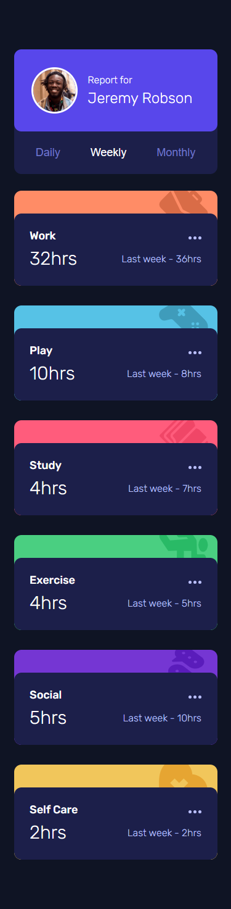
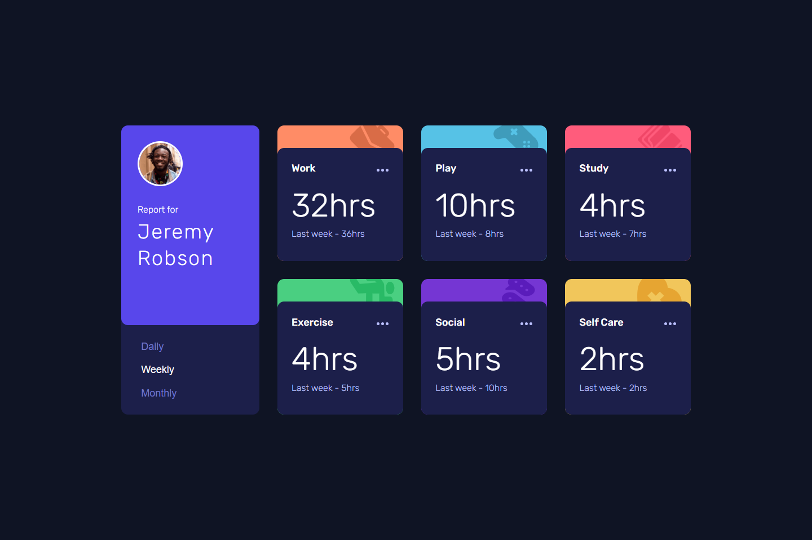

# ⏱️ Time Tracking Dashboard

Учебный проект с [Frontend Mentor](https://www.frontendmentor.io/).  
Приложение отображает статистику по различным видам деятельности (работа, игры, упражнения и т.д.) за **день / неделю / месяц**.  

Это мой первый опыт работы с **JSON**, а также с функциями **fetch** и **async/await**.

## 🚀 Live Demo
👉 [Посмотреть на GitHub Pages](https://lizakein.github.io/time-tracking-dashboard/)

---

## ✨ Функциональность
- Переключение временных интервалов (**Daily / Weekly / Monthly**)  
- Карточки с данными:
  - текущие часы
  - предыдущий период (сравнение)  
- Данные подгружаются из `data.json` через `fetch`  
- Динамическое обновление DOM без перезагрузки страницы  
- Адаптивный интерфейс (**mobile-first**)  
- Pixel Perfect по макету из Figma   

---

## 🛠️ Технологии
- **HTML5**, **CSS3** (адаптив, mobile-first)
- **JavaScript (ES6+)**
- **fetch API** + `async/await`
- Работа с **JSON**
- Макет из **Figma** (pixel perfect)

---

## 📦 Установка и запуск
1. Склонируйте репозиторий:
   ```bash
   git clone https://github.com/lizakein/todo-app.git
2. Запустите локальный сервер (например, через расширение Live Server в VS Code), чтобы fetch мог получить данные из data.json.
(или перейдите по [Live Demo](https://lizakein.github.io/time-tracking-dashboard/)

---

## 🎯 Чему я научился
- Работать с локальными JSON-данными
- Использовать fetch и async/await
- Организовывать динамическое обновление интерфейса
- Реализовывать переключение состояний кнопок (aria-pressed, active)
- Делать адаптивную верстку с подходом mobile-first
- Совмещать практику JS с Pixel Perfect версткой

---

# 📸 Скриншоты

**Mobile версия**



**Desktop версия**



---

## 📌 Статус проекта

✅ Завершён (в рамках учебного задания)
Возможные улучшения:
- Добавить сохранение выбранного временного интервала в localStorage
- Темная/светлая тема
